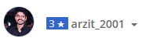

### Hello!Welcome

  

  
<ul>
 <li><h4> <b> 3 🌟 on codechef </b></h4></li>
 <li><h4> <b> ✌self taught web dev <b> </h4></li>
 <li><h4> <b> CSE student✨✨ <b> </h4></li>
 <li><h4> <b> Not a machine🌚 <b> </h4></li>
</ul>

hi, i'm **Arijit Panda**, a passionate self-taught full stack web developer and a freelance software engineer from india. my passion for software lies with dreaming up ideas and making them come true with elegant interfaces.

I am currently doing my B.Tech in CSE  from[Trident Academy of Technology](https://tat.ac.in/),Bhubaneswar.

  
  
- 💼 any freelance work? do reach, [email](mailto:arzit43.143@gmail.com) :)
- 💬 ask me about anything, i am happy to help;

   
   
<!--
**ArzitPanda/ArzitPanda** is a ✨ _special_ ✨ repository because its `README.md` (this file) appears on your GitHub profile.

Here are some ideas to get you started:

- 🔭 I’m currently working on ...
- 🌱 I’m currently learning ...
- 👯 I’m looking to collaborate on ...
- 🤔 I’m looking for help with ...
- 💬 Ask me about ...
- 📫 How to reach me: ...
- 😄 Pronouns: ...
- ⚡ Fun fact: ...
-->
